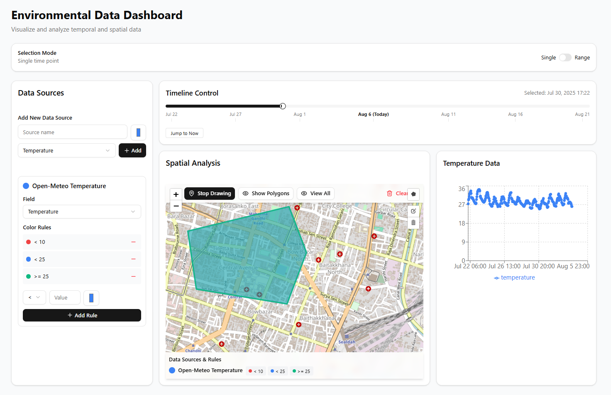

# Environmental Data Dashboard



A Next.js application for visualizing environmental data with interactive maps and temporal controls.

## Features

- 🗺️ Interactive Leaflet map with polygon drawing (3-12 points)
- ⏳ Timeline slider with single-point and range selection modes
- 🎨 Data source management with customizable color rules
- 🌡️ Real-time weather data from Open-Meteo API
- 📍 Polygon persistence and temperature visualization
- 📱 Responsive dashboard layout

## Tech Stack

- **Framework**: Next.js
- **Language**: TypeScript
- **State Management**: Zustand
- **Mapping**: Leaflet + React-Leaflet
- **Charts**: Recharts
- **UI**: Shadcn/ui + Tailwind CSS
- **Utilities**: date-fns

## Getting Started

### Prerequisites

- Node.js (v18 or later)
- npm (v9 or later)

### Installation

1. Clone the repository:
   ```bash
   git clone https://github.com/your-username/environmental-dashboard.git
